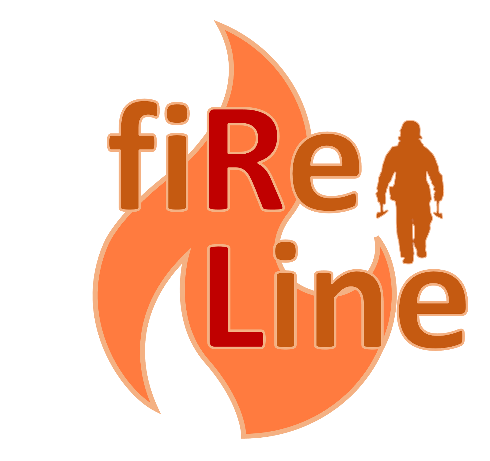
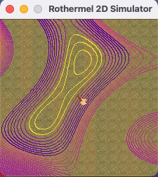
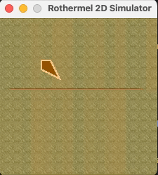

# Rothermel Fire Modeler

<p align="center">
    
</p>

## Introduction

The Rothermel Fire Modeler uses [PyGame](https://www.pygame.org/wiki/about) to display and simulate the Rothermel Surface Fire Spread Model described in [this](https://www.fs.fed.us/rm/pubs_series/rmrs/gtr/rmrs_gtr371.pdf) paper.

For more comprehensive documentation, go to our [docs page](https://fireline.pages.mitre.org/rothermel-modeling).

<p align="center">
  
  
</p>

## Running the Simulation

Clone the repository:

```shell
git clone git@gitlab.mitre.org:fireline/rothermel-modeling.git
```

Then, install the requirements:

```shell
pip install -r requirements.txt
```

And run the `game_rothermal.py` script:

```shell
python game_rothermel.py
```

## Contributing

For contributing, see the [Contribution Page](https://fireline.pages.mitre.org/rothermal-modeling/contributing.html) in our [docs](https://fireline.pages.mitre.org/rothermel-modeling).
