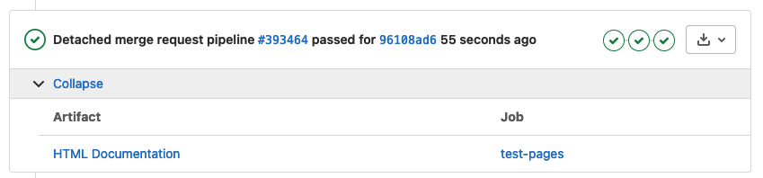

# Contributing

Contributing to the Rothermel Fire Modeling codebase ([GitLab](https://gitlab.mitre.org/fireline/rothermel-modeling)) requires a process to be followed. This page will explain how to follow that process and will provide some tools to make local development easier.

**Some guidlines**:
  1. Nobody can commit directly to `master`.
  2. You must create a merge request in order to publish changes to `master`.
  3. Before merging, all stages of the GitLab CI pipeline must pass. This includes linting with [`flake8`](https://flake8.pycqa.org/en/latest/) ([config](https://gitlab.mitre.org/fireline/rothermel-modeling/-/blob/master/.flake8)), code-formatting with [`yapf`](https://github.com/google/yapf) ([config](https://gitlab.mitre.org/fireline/rothermel-modeling/-/blob/master/.style.yapf)), passing the Python unit tests, and creating the documentation.
  4. Once all pipeline stages have passed, then the branch can be merged into master.
  5. These pipeline stages can be tested locally to ensure that they are passed on the remote side (explained in [Using Pre-commit](#using-pre-commit))

## Issue & Merge Request Creation
Create or assign an issue to yourself at the [Group Issue Board Page](https://gitlab.mitre.org/groups/fireline/-/boards), add the label `Rothermel Model`, and move it to “Doing”.

Create a merge request based on that issue using the "Create Merge Request" button on the issue page.

## Environment Setup

First, clone the repository:

```shell
git clone git@gitlab.mitre.org:fireline/rothermel-modeling.git
```

Then, install the **developer** requirements:

```shell
pip install -r dev-requirements.txt
```

## Using Pre-commit

If you'd like, you can install [pre-commit](https://pre-commit.com/) to run linting and code-formatting before before you are able to commit. This will ensure that you pass this portion of the remote pipelines when you push to your merge request.

```shell
pip install pre-commit
pre-commit install
```

Now, every time you try to commit, your code that you have staged will be linted by `flake8` and auto-formatted by `yapf`. If the linting doesn’t pass pre-commit, it will tell you, and you’ll have to make those changes before committing those files. If `yapf` autoformats your code during pre-commit, you can view those changes and then you’ll have to stage them. Then you can commit and push.

Pre-commit can also be run manually on all files without having to commit.

```shell
pre-commit run --all-files
```

## Running Unit Tests

There are also unit tests that need to be passed, and to make sure you are passing those locally (before pushing to your remote branch and running the pipeline) you can run the following command in the root directory:

```shell
python -m unittests discover -s src -t .. -p "test_*.py"
```

This will search for all `test_*.py` files and run the tests held in those files.

## Adding Packages & Modules

If you add a package or module, make sure to create a unit test for it and preferably all classes and functions within it. When creating a package (directory with Python modules), add a `_tests` directory that mirrors the package directory. See the example below:

```
src
├── game
│   ├── managers
│   │   ├── __init__.py
│   │   ├── _tests
│   │   │   ├── __init__.py
│   │   │   ├── test_fire.py
│   │   │   └── test_mitigation.py
│   │   ├── fire.py
│   │   └── mitigation.py
```

In the `managers` package, there are two modules, `fire` and `mitigation`. These are mirrored in the `_tests` directory as `test_fire.py` and `test_mitigation.py`. And inside each of those, there is a mirrored `Test` class for every class in each module:

### fire.py
```python
class FireManager():
```

### test_fire.py
```python
class TestFireManager(unittest.TestCase):
```

And _usually_, there is a test for every testable function in that class. Try to adhere to this standard when creating new packages, modules, classes, and functions.

## Adding Documentation

API documentation is autogenerated by [Sphinx AutoAPI](https://sphinx-autoapi.readthedocs.io/en/latest/).

If you'd like to add to this documentation, you can create markdown or `.rst` files in the `docs/source` directory, and **add them to the `index.rst`** under the `toctree`:

```rst
Welcome to fiReLine Rothermal Fire Modeler documentation!
===========================================================

.. toctree::
   :maxdepth: 1
   :caption: Contents:

   intro.md
   <Your Markdown or RST file here>
   contributing.md
   modules
```

Where your file is located in that `toctree` (Table of Contents Tree) is where the page will exist in the sidebar and on the homepage.

### Pushing Doc Changes to MRs

Every time changes are pushed to a merge request, artifacts will be created that will allow you to view the hosted version of the GitLab Pages documentation, seen if you click on _HTML Documentation_ (see below) and navigate to `public/index.html`.



### Testing Documentation Locally

In order test documentation locally, you'll first have to install all the necessary packages that are left out of the `requirements.txt` (this is installed automatically during CI):

```shell
pip install sphinx sphinx-autoapi sphinx-rtd-theme myst-parser
```

Then, you can build the documentation and view it by opening the `index.html` file located at:

```
docs/build/html/index.html
```

If you're working locally, just find the file location, and open the file in a browser by copying the path.
